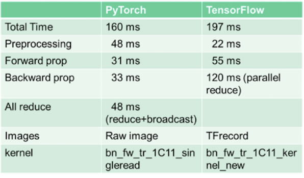

## TensorFlow 와 PyTorch 딥러닝 프레임워크를 알아보자

딥러닝 알고리즘은 `인지상의 문제`를 효과적으로 해결하는데 도움됩니다. 두 개의 인지도가 높은 프레임워크인 `TensorFlow` 와 `PyTorch`를 활용해보겠습니다.

### 1. TensorFlow(TF)

Google은 `DistBelief` 의 독점적인 머신러닝언어를 시작으로 나중에 `TensorFlow`의 이름으로 변경했어요. 처음에는 TF는 `파이썬`(Python)을 사용, 프레임워크로 애플리케이션을 구축하기 위한 프론트엔드 API를 제공하며 성능이 우수한 `C++`로 애플리케이션을 실행해요. 쉽게말해, 프론트엔드는 파이썬으로, 백엔드는 C++로 사용해요.

**Define-and-Run**

TF의 패러다임은 Define and Run 방식이에요. 연산 그래프를 먼저 생성하고 실제 연산할 때 값을 전달하여 결과를 얻어요. 

**Static Graph**

TF의 그래프 형태는 `정적 그래프`에요. 그러나 정적 그래프는 디버깅이 어려워요. `tfdbg`의 디버깅툴을 제공하지만, the tensors and their operations를 분석하는데만 도움되어요.

### 2. PyTorch

Torch는 `Lua Programming Language` 를 베이스로한 `오픈소스 머신러닝 라이브러리`에요. 시간이 지나 Python기반의 라이브러리로 전환했고 이제는 `PyTorch`라고 이름을 불러요.

PyTorch는 `PDB(Python Debuger)` 를 사용하여 디버깅이 가능해요. TF와는 다르게 그러나 TensorBoard와 같은 visualizer(시각화 도구)가 없다고 해요. 하지만, 최근 프레임워크가 빠르게 발전하면서 visualizer중심으로 개발되어지고 있는데 이는 TF 사용자들이 PyTorch를 접하면서 허전함을 느끼게되어요. 이는 대안이 나오면서 어느정도 해결이 되어요.

**Define-by-Run**

텐서플로우의 Define-and-Run과는 달리 그래프를 만듦과 동시에 결과를 얻어요.

**Dynamic Graph**

PyTorch는 `동적 그래프` 를 사용해요. 그래프를 만들 때 고정상태가 아니기 때문에 언제든지 데이터에 따라 조절이 가능해요.

### 3. Conclusion

**어떤 프레임워크를 사용할건가요?** : `PyTorch`를 사용하겠습니다.

**Why ?** :  그 이유는 학습자의 초기 학습속도가 빠르며 속도가 TF보다 빠르다는 것입니다.  저희 프로젝트는 빠른 이미지 처리를 필요로합니다. 실제로 PyTorch와 TF 로 이미지 1장을 처리하는 Inference Time이 PyTorch가 TF보다 약 1.2~ 1.5배 빠릅니다. 또한 `지도 학습` 중간중간에 결과를 확인할 수 있습니다. 바로 이러한 이유 때문입니다.

