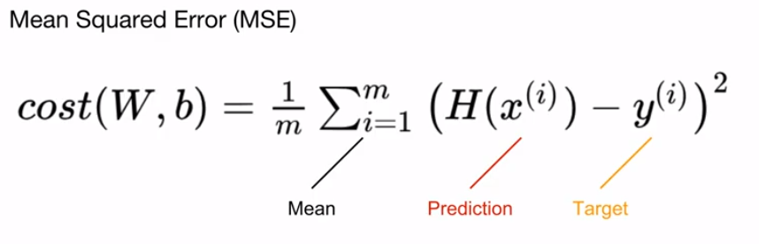

# Linear regression 선형 회귀

한개 이상의 독립 변수 x와 종속변수 Y와의 선형 상관관계를 모델링하는 회귀분석 기법이에요.

아래는 독립변수 1개와 종속변수 1개를 가진 선형회귀를 테스트해요

하나의 정보로 부터 하나의 결과값을 예측하는 거에요.

## Hypothesis
Hypothesis는 인공신경망의 구조를 나타내는 데, 주어진 input x에 대해 어떤 출력이 나올지 예측해줍니다. W와 b의 변수를 학습하여 데이터를 최적화 하는 것이에요.

$$
y = Wx + b
$$

```python
x_train = torch.FloatTensor([[1], [2], [3]])
y_train = torch.FloatTensor([[2], [4], [6]])
```

```python
W = torch.zeros(1, requires_grad=True)
b = torch.zeros(1, requires_grad=True)
hypothesis = x_train * W + b
```

* Weight 와 Bias 0 으로 초기화
  * 항상 출력 0을 예측
* requires_grad = True
  * 학습할 것이라고 명시


## Compute loss
모델의 좋고 나쁨을 평가해요. Cost를 구해요.



Cost는 모델 예측값이 실제 예측값과 얼마나 다른지 나타내는 값으로,  잘 학습될 수록 낮은 값을 가져요. 1에서 멀어질수록 높아지는 것이죠.

```python
x_train = torch.FloatTensor([[1], [2], [3]])
y_train = torch.FloatTensor([[2], [4], [6]])
```

```python
W = torch.zeros(1, requires_grad=True)
b = torch.zeros(1, requires_grad=True)
hypothesis = x_train * W + b
```

```python
cost = torch.mean((hypothesis - y_train ) ** 2)
```

* torch.mean으로 평균 계싼
* 한 줄인데 읽기 편함


## Gradient descent

위의 Cost Function을 최소화 하기 위해 기울기의 Gradient를 최적화

```python
x_train = torch.FloatTensor([[1], [2], [3]])
y_train = torch.FloatTensor([[2], [4], [6]])
```

```python
W = torch.zeros(1, requires_grad=True)
b = torch.zeros(1, requires_grad=True)
hypothesis = x_train * W + b
```

```python
cost = torch.mean((hypothesis - y_train ) ** 2)
```

```python
optimizer = torch.optim.SGD([W,  b], lr=0.01)

optimizer.zero_grad()
cost.backward()
optimizer.step()
```

* torch.optim 라이브러리 사용
  * [W, b] 는 학습할 Tensor 들
  * lr=0.01은 learning rate
* 항상 붙는 3줄
  * zero_grad() 로 gradient 초기화
  * backward() 로 gradient 계산
  * step() 으로 개선


# Full Training Code

```python
x_train = torch.FloatTensor([[1], [2], [3]])
y_train = torch.FloatTensor([[2], [4], [6]])

W = torch.zeros(1, requires_grad=True)
b = torch.zeros(1, requires_grad=True)

optimizer = torch.optim.SGD([W,  b], lr=0.01)

# 아래는 학습
nb_epochs = 1000
for epoch in range(1, nb_epochs + 1):
    # H(x) 계산
    hypothesis = x_train * W + b
    
    # Cost Gradient 계산
    cost = torch.mean((hypothesis - y_train) ** 2)
    
    optimizer.zero_grad()
    cost.backward()
    optimizer.step()
    
    print('Epoch : {:4d}/{}, W: {:.3f}, b:{:.3f}, Cost: {:.6f}'.format(epoch, nb_epochs, W.item(), b.item(), cost.item()))
```

|      | 선언문            | 반복문 ( 학습 )  |
| ---- | ----------------- | ---------------- |
| 1    | 데이터 정의       | Hypothesis 예측  |
| 2    | Hypothesis 초기화 | Cost 계산        |
| 3    | Optimizer 정의    | Optimizer로 학습 |

* Epoch : 데이터로 학습한 횟수
* 학습하면 서 점점 
  * 수렴하는 W, b
  * 줄어드는 cost (잘 학습되었다는 의미)


