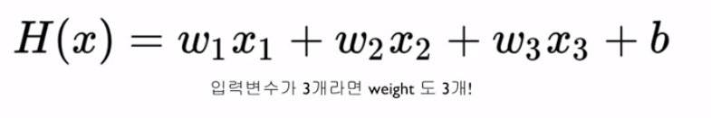
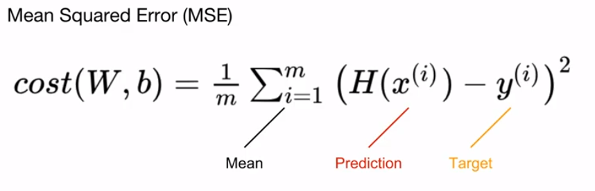

# Multivariate Linear Regression

복수의 정보가 존재할 때 하나의 결과값을 예측하는 거에요.


## DATA

```python
x_train = torch.FloatTensor([[73, 80, 75], [93, 88, 93], [89, 91, 90], [96, 98, 100], [73, 66, 70]])
y_train = torch.FloatTensor([[152],[185],[180],[196],[142]])
```


## Hypothesis Function




```python
hypothesis = x1_train * w1 + x2_train * w2 + x3_train * w3 + b
```

하지만 x의 길이가 10000의 vector라면??....... 이를 해결하기 위해 `matmul()`을 사용해요.

```python
hypothesis = x_train.matmul(W) + b 
```

이는 간결할뿐만아니라,  속도도 더 빨라요


## Cost Function : MSE



앞의 SImple Linear Regression과 동일한 방식이에요.

```python
cost = torch.mean((hypothesis - y_train ) ** 2)
```


## Gradient descent

앞의 Simple Linear Regression과 동일해요

```python
optimizer = torch.optim.SGD([W,  b], lr=0.01)

optimizer.zero_grad()
cost.backward()
optimizer.step()
```


## Full Code

```python
x_train = torch.FloatTensor([[73, 80, 75], [93, 88, 93], [89, 91, 90], [96, 98, 100], [73, 66, 70]])
y_train = torch.FloatTensor([[152],[185],[180],[196],[142]])

W = torch.zeros((3,1), requires_grad=True)
b = torch.zeros(1, requires_grad=True)

optimizer = torch.optim.SGD([W, b], lr=1e-5)

nb_epochs = 20
for epoch in range(nb_epochs + 1):
    hypothesis = x_train.matmul(W) + b
    
    cost = torch.mean((hypothesis - y_train) ** 2)
    
    optimizer.zero_grad()
    cost.backward()
    optimizer.step()
    
    print('Epoch : {:4d}/{}, hypothesis: {}, Cost: {:.6f}'.format(epoch, nb_epochs, hypothesis.squeeze().detach(), cost.item()))
```

* 점점 작아지는 Cost,
* 점점 y에 가까워지는 H(x)
* Learning rate 에 따라 발산할수도!


## 편리한 모듈을 사용합시다.

### nn.Module

**before**

```python
W = torch.zeros((3,1), requires_grad=True)
b = torch.zeros(1, requires_grad=True)

hypothesis = x_train.matmul(W) + b
```


**after**

```python
model = MultivariateLinearRegressionModel()

hypothesis = model(x_train)
```


### F.mse_loss

**before**

```python
cost = torch.mean((hypothesis - y_train) ** 2)
```


**after**

```python
import torch.nn.functional as F

cost = F.mse_loss(prediction, y_train)
```

