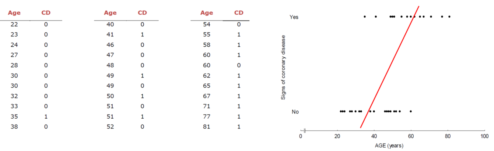
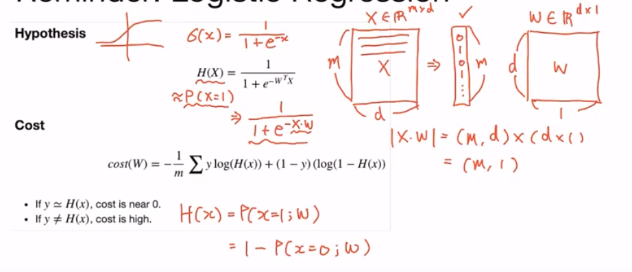

# Logistic Regression

Logistic Regression은 범주형 변수를 예측하는 모델이에요. 

앞에서 배운 **Multiple Linear Regression**은 수치형 설명변수 X와 연속형 숫자로 이뤄진 종속변수 Y간의 관계를 선형으로 가정하고 이를 가장 잘 표현할 수 있는 회귀계수를 데이터로부터 추정하는 모델입니다. 하지만 연속형 변수 대신 범주형 변수인 경우는 어떨까요? 예를 들어 Y가 0또는 1일 때..




 이처럼 Y가 범주형 변수일 때는 **Multiple Linear Regression**을 그대로 적용할 수 없어요. 그래서 **Logistic Regression**을 사용해요.


## Training Data

시간데이터가 있어요. x와 y의 인자의 뜻은

[1, 2] : 강의를 1시간 듣고 연구소에서 2시간을 소비

[0] : Fail, [1] : Pass 

```python
x_data = [[1, 2], [2, 3], [3, 1], [4, 3], [5, 3], [6, 2]]
y_data = [[0], [0], [0], [1], [1], [1]]
```

### 1. Tensor 자료형으로 변환

일단 이것을 Tensor 자료형으로 변환하고 shape를 확인합시다.

```python
x_train = torch.FloatTensor(x_data)
y_train = torch.FloatTensor(y_data)
print(x_train.shape)
print(y_train.shape)
```

```
torch.Size([6, 2])
torch.Size([6, 1])
```


### 2. Computing the Hypothesis



그냥 확인용...
```python
print('e^1 equals: ', torch.exp(torch.FloatTensor([1])))
```

W, b를 생성

```python
W = torch.zeros((2, 1), requires_grad = True)
b = torch.zeros(1, requires_grad = True)
```


다음으로 Hypothesis를 생성. 위 사진의 공식을 표현합니다.

```python
hypothesis = 1 / ( 1+ torch.exp(-(x_train.matmul(W)+ b)))
```


그러나 이는 `torch.sigmoid()`로 간단한 표현으로 대체가능합니다.

```python
hypothesis = torch.sigmoid(x_train.matmul(W)+b)
```


다음으로 hypothesis를 확인합니다.

```python
print(hypothesis)
print(hypothesis.shape)
```

```
tensor([[0.5000],
        [0.5000],
        [0.5000],
        [0.5000],
        [0.5000],
        [0.5000]], grad_fn=<SigmoidBackward>)
torch.Size([6, 1])
```


### Computing the Cost Function

Hypothesis를 생성했으니 이제는 Cost Function 차례입니다.

위 사진에서 Cost funtion 함수를 확인가능

하나의 요소를 확인해봅시다.

```python
-(y_train[0] * torch.log(hypothesis[0]) + ( 1- y_train[0] )* torch.log(1-hypothesis[0]))
```

```
tensor([0.6931], grad_fn=<NegBackward>)
```


그럼 전체 losses를 구해봅시다.

```python
losses = -(y_train * torch.log(hypothesis) + ( 1- y_train )* torch.log(1-hypothesis))
print(losses)
```

```
tensor([[0.6931],
        [0.6931],
        [0.6931],
        [0.6931],
        [0.6931],
        [0.6931]], grad_fn=<NegBackward>)
```


cost는 이 losses들의 평균입니다.

```python
cost = losses.mean()
print(cost)
```

```
tensor(0.6931, grad_fn=<MeanBackward0>)
```


losses 수식을 직접 표현해서 평균 낸 뒤 cost를 구했는데 아래와 같이 간단히 표현가능해요

```python
F.binary_cross_entropy(hypothesis, y_train)
```

```
tensor(0.6931, grad_fn=<BinaryCrossEntropyBackward>)
```


## Full Code

```python
W = torch.zeros((2, 1), requires_grad=True)
b = torch.zeros(1, requires_grad=True)

optimizer = optim.SGD([W, b], lr=1)

nb_epochs = 1000
for epoch in range(nb_epochs + 1):
    # Cost 계산
    hypothesis = torch.sigmoid(x_train.matmul(W) + b)
    cost = F.binary_cross_entropy(hypothesis, y_train)
    
    # cost로 H(x) 계산
    optimizer.zero_grad()
    cost.backward()
    optimizer.step()
    
    if epoch % 100 == 0:
        print('Epoch {:4d}/{} Cost: {:.6f}'.format(epoch, nb_epochs, cost.item()))
```

```
Epoch    0/1000 Cost: 0.693147
Epoch  100/1000 Cost: 0.134722
Epoch  200/1000 Cost: 0.080643
Epoch  300/1000 Cost: 0.057900
Epoch  400/1000 Cost: 0.045300
Epoch  500/1000 Cost: 0.037261
Epoch  600/1000 Cost: 0.031672
Epoch  700/1000 Cost: 0.027556
Epoch  800/1000 Cost: 0.024394
Epoch  900/1000 Cost: 0.021888
Epoch 1000/1000 Cost: 0.019852
```

학습을 100단위로 끊어서 봤을 때는 순조롭게 내려와요.

그러나 5단위로 끊고 확인했을 때는 올라가기도 해요


코드를 다시 봅시다.

optimizer는 optim의 SGD를 이용해서 W와 b를 학습시킵니다. 어떻게 ? lr (Learning Rate)가 1인 상태로 학습한다. 그리고 H(x)를 구할 때 optimizer를 초기화 하기위해 zero_grad() 를 사용해요.

cost.backward()를 수행해요 이로인해 W와 b는 gradient가 구해져있을 거에요.

이는 다음 optimizer.step()을 통해 cost값을 최소화하는 방향으로 gradient를 사용해요.


## 성능의 정확도가 얼머나 훌륭한지? Evaluation

### 모델의 정확도를 분석해봅시다.

모델의 훈련이 끝난 처음에는 얼마나 훈련되었는지 확인해보고 싶어요.

```python
hypothesis = torch.sigmoid(x_train.matmul(W) + b)
print(hypothesis[:5])
```


예측 모델을 구해요

```python
prediction = hypothesis >= torch.FloatTensor([0.5])
print(prediction)
```


이 예측모델과 y_train과 비교해봐요

```python
# print(prediction[:5])
# print(y_train[:5])

correct_prediction = prediction.float() == y_train
print(correct_prediction)
```

```
tensor([[True],
        [True],
        [True],
        [True],
        [True],
        [True]])
```

따라서 이 correct_prediction의 평균으로 정확도를 분석할 수 있어요.


## Class를 만들어 봅시다.

이번엔 클래스로 만들어서 고급지게 만들어봅시다.

```python
class BinaryClassifier(nn.Module):
    def __init__(self):
        super().__init__()
        self.linear = nn.Linear(8, 1)
        self.sigmoid = nn.Sigmoid()
    
    def forward(self, x):
        return self.sigmoid(self.linear(x))
```

```python
model = BinaryClassifier()
```


