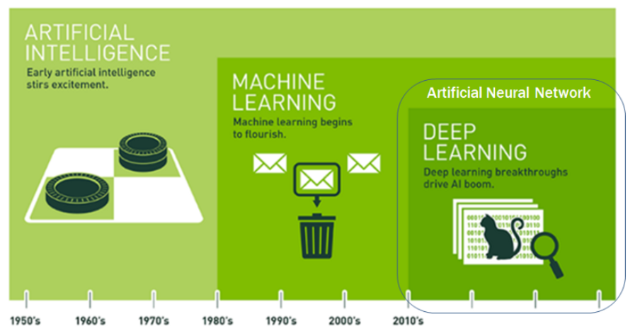
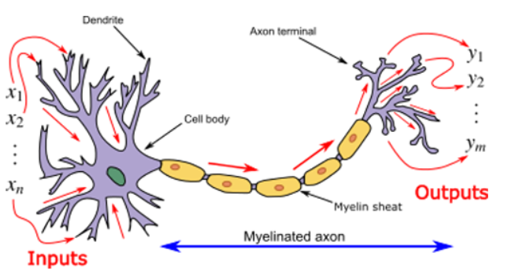

# AI 이론

#### - 인공지능 ⊃ 머신러닝 ⊃ 딥러닝 

[1] 

### 1. 인공지능

인공지능이란 기계 혹은 시스템에 의해 만들어진 지능을 뜻한다. 인간이 지닌 지적 능력을 인공적으로 구현한 것들 모두 인공지능에 포함된다. 인공 지능을  구현하는 방법은 기계학습, 머신러닝이 있다. 딥러닝은 머신러닝 방법 중 하나이며 인공신경망의 한 종류이다.

### 2. 머신러닝

기계가 데이터를 학습함으로써 숨겨진 일련의 규칙성을 찾는다. 규칙성을 기반으로 새 데이터를 평가, 예상하고 우리가 활용할 수 있게 한다. 예를 들어서 강아지와 고양이를 구별하기 위해 많은 이미지 파일을 통해 학습을 한다. 여러 파라미터(귀의 형태, 입의 구조, 수염 유무, 털의 형태)에 대한 가중치를 설정하고 이를 통해 최종적으로 분류를 가능하게 한다.

머신러닝의 학습 모델은 지도학습, 비지도학습, 강화학습이 있다.

- 지도학습 : 입력과 결과값을 이용한 학습
- 비지도학습 : 입력만을 이용한 학습이며, Clustering이 대표적이 예이다.
- 강화학습 : 결과값 대신 리워드(reward)를 이용한 학습모델

### 3. 딥러닝

딥러닝은, 머신러닝에 속하는 대표적인 방법론으로 인간의 뇌 신경망을 모방한 인공신경망의 한 종류이다. 인공신경망 뉴런 모델은 뉴런을 수학적으로 모델링한 것으로, 뉴런이 여러 뉴런으로부터 받은 입력값을 출력값으로 내보내는 현상을 적용한 것이다. 

[2]

기존의 인경신경망의 Vanishing Gradient 문제 등이 있지만, 이러한 한계를 극복한 것이 딥러닝이라고 할 수 있다. 지도학습, 비지도학습, 강화학습에 이용될 수 있으며, 데이터 자체를 통하여 학습을 시키고 이를 통해 분류를 가능하게 한다. 

#### 출처

[1] https://brunch.co.kr/@gdhan/7

[2] https://en.wikipedia.org/wiki/Biological_neuron_model

